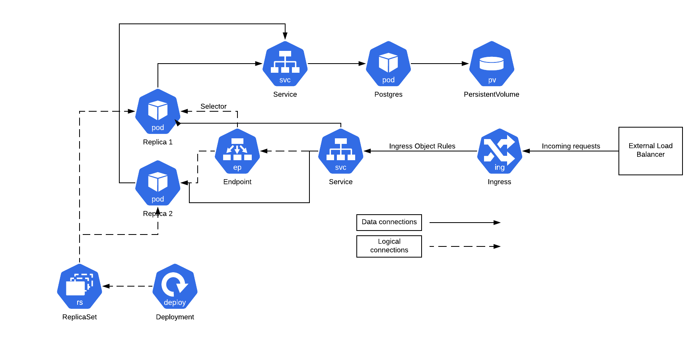
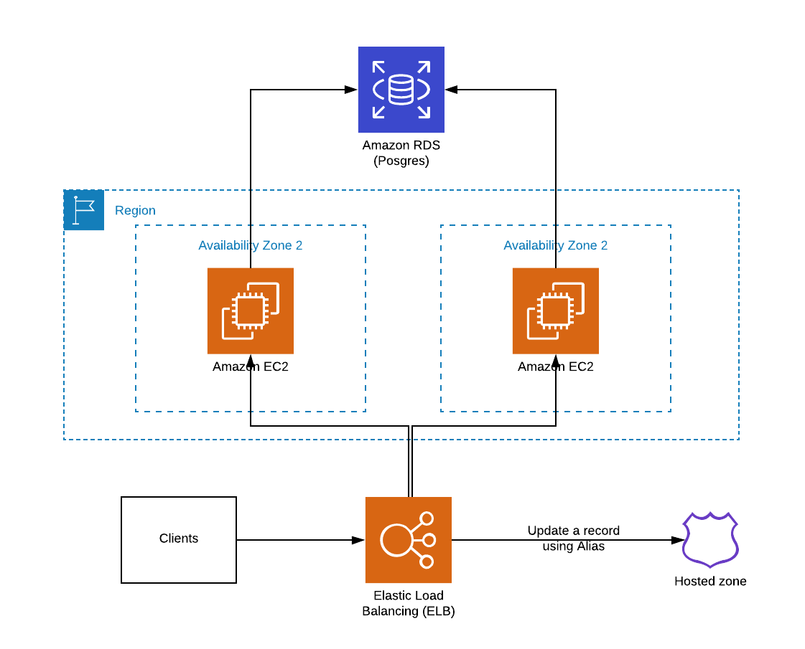

# What is that?

That is a simple REST application with a Postgres as a database.

# How to run it?

The app requires a Postgres database. You can run one in docker by `make postgres_up` command and stop/clean 
it by `make posgres_down`.

If you have Docker (and you probably have), you can simply call `make run` to run a latest version on your local machine.

If not - you can build the app by `make build` and then run it by `bin/simple_rest`.

Also, you can build your own copy of a container by `make imageVERSION=myver` and than run it by `make run VERSION=myver`.

# How to run tests?

Run Postgres by `make postgres_up` and call `make tests` to run tests in a contaner or `make tests_local` to run them locally (go needed). Don't forget to check output:).

# What if I want to build it in a CI system?

Just call `make image` and `make push`. Don't forget to set right `VERSION` and `IMAGE` variables.

# What if I want to deploy it somewhere?

You can use a helm chart from a `helm` directory to deploy an app to a Kubernetes cluster.

Chart values described in a `values.yaml` file in a root of the chart dir. 

Before install, you should setup a database somewhere. One of ways is to create the database inside a Kubernetes cluster using
a `postgres` Helm chart. You can use prepared values for it from the `helm` dir.

Command to install: `helm install --name=postgres stable/postgresql -f helm/postgres-values.yaml` 

Then, you need to install the application: `helm install --name=simple-rest helm/simple-rest -f path_you_your_values_file.yaml`

Of you will not create and apply your values file, the app will be created without ingress and to connect it you should use
a port forward like `kubectl port-forward svc/simple-rest-simple-rest 8080:80`

If you want to make a rolling update (that mode is enabled in a chart by default), just call `helm update simple-rest helm/simple-rest -f path_you_your_values_file.yaml`

### How it will looks like in K8s?

That is how an architecture will looks like if you will deploy the app using a Helm chart.

 
 

### How it will looks like in AWS?

If you will use AKS it will looks pretty same as in any other K8s installation.

But, if you want to deploy it to a VMs (which is actually not a best idea), you will need to setup something like that:

 
 
 
### What about GCE?

You can use a same architecture as for AWS, but it is better to use GKE instead.

